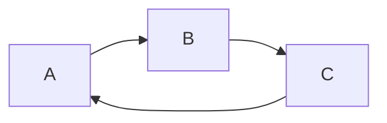
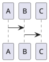
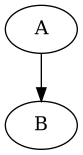
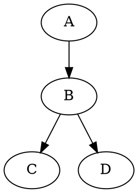
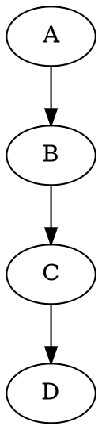

# Diagramming Tools

## [js-sequence-diagrams](https://bramp.github.io/js-sequence-diagrams/)
```sequence {theme="hand"}
Bule->Rosa: Says Apa Kabar?
Note right of Rosa: Rosa thinks\nfor a second
Rosa-->Bule: Baik, baik, saja.
Bule->>Rosa: Baik!
```

## [Mermaid](https://mermaid-js.github.io/mermaid/#/)



## [PlantUML](https://plantuml.com/)

```puml
A -> B
```





## [GraphViz](https://github.com/mdaines/viz.js)





