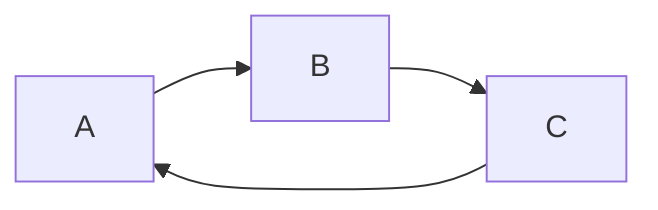
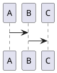
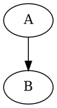
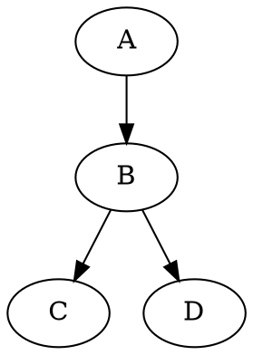
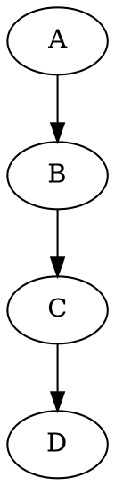

# Diagramming Tools

## [js-sequence-diagrams](https://bramp.github.io/js-sequence-diagrams/)
```sequence {theme="hand"}
Alice->Bob: Says Apa Kabar?
Note right of Bob: Bob thinks\nfor a second
Bob-->Alice: Baik, baik, saja.
Alice->>Bob: Baik!
```

## [Mermaid](https://mermaid-js.github.io/mermaid/#/)



## [PlantUML](https://plantuml.com/)

```puml
A -> B
```





## [GraphViz](https://github.com/mdaines/viz.js)





## SVG
<svg height="100" width="100">
<circle cx="50" cy="50" r="40" stroke="black" stroke-width="3" fill="red" />
<rect x="25" y="25" width="50" height="50" stroke="orange" stroke-width="3" fill="blue" />
</svg>