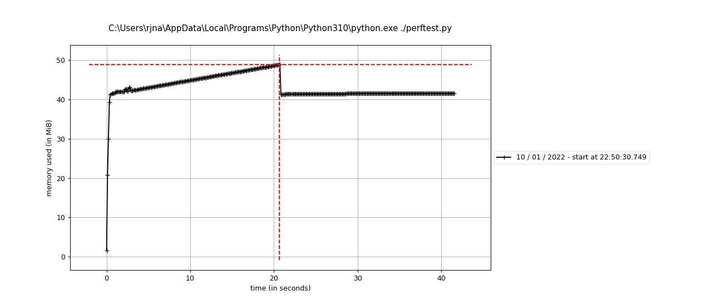

# Salsa20

This purpose of this script is to implement the Salsa20 cipher in python. The implementation details here: [salsa20.py](salsa20.py).

<span style="color:red">Warning: This repository is for educational purposes only. Never use any of these ciphers in actual production code unless you want things to go awry.</span>

### Known Limitations

* Lack of robust input checking. I wanted to show minimalist code to focus on the implementation details only. It will crash if you are not playing nice.
* Initial block counter parameter does not check if greater than total number of 64-byte blocks for input data.
* No attempt made at padding since it is not mentioned as a requirement in the specification. It works though for all sizes of input including those that are not 64-byte aligned.

## Setup
I developed this with Python 3.10 but any version >= 3.6.5 should work. I did not use any special modules outside of the core python except for optional testing enhancements and simple performance benchmarking.

You can "optionally" install the [Cryptodome.Cipher for Salsa20](https://pycryptodome.readthedocs.io/en/latest/src/cipher/salsa20.html) and  [Memory Profiler](https://pypi.org/project/memory-profiler/) by running the following command:
```
pip install -r requirements.txt
```
To verify that everything is working, run the [tests.py](tests.py) script as follows:
```
python ./tests.py
```
The tests should complete without failures within a few seconds.

To check the memory and timing performance, run th [perftest.py](perftest.py) script as follows:
```
mprof run perftest.py
mprof plot
```
You get a nice plot showing the memory usage between salsa20() and salsa20generator() differ. The former uses more.



## Execution

### Command Line
If you want to test some of your own inputs, I recommend starting with the [client.py](client.py) script:

```
$ python ./client.py -h
usage: client.py [-h] [-c COUNTER] [-i INPUT] [-K16] [-K32] [-k KEY] [-m MSG] [-n NONCE] [-o OUTPUT] [-r RMSG]

This script is used for testing salsa20.py

options:
  -h, --help            show this help message and exit
  -c COUNTER, --counter COUNTER
                        Start block counter value (default: 0)
  -i INPUT, --input INPUT
                        Path to an input data file (optional) (default: None)
  -K16                  Use the default 16-byte key: "Qk1gJ4[,wK84f7YN" (default: False)
  -K32                  Use the default 32-byte key: "RHrz29NzfVBksS}Q}3ARAGwXbWe.q.Id" (default: False)
  -k KEY, --key KEY     Supply your own secret 16/32 byte key (default: None)
  -m MSG, --msg MSG     Input plaintext/ciphertext (default: Don't roll your own Crypto!)
  -n NONCE, --nonce NONCE
                        Supply your own 8-byte nonce (default: 7pwvG$T1)
  -o OUTPUT, --output OUTPUT
                        Path to an utput data file (optional) (default: None)
  -r RMSG, --rmsg RMSG  Generate an auto random input message of -r [bytes] (default: None)
```
Example 1: Read the provided input plaintext file and write an output ciphertext file.
```
python ./client.py -i shakespeare-plain.txt -o shakespeare-cipher.txt -K32
```
Example 2: Now do the opposite to see if you can recover the plaintext
```
python ./client.py -i shakespeare-cipher.txt -K32
```
Note that for both cases, the default -K32 key and nonce were used. You can provide your own key and nonce with the -k <key> and -n <nonce> options respectively. Make sure to use the same ones though when doing both encryption and decryption.

Example 3: Here is a simple case where you provide your own key and message via the command line.
```
python ./client.py -k "_+92eF33yM1sj6Bx)q2(zFDh4*2zV#}*" -m "Don't role your own crypto"
```

### Source Code

Two APIs are offered here:
```
import salsa20
ciphertext = salsa20.salsa20(plaintext, key, nonce, counter)
```
Or if you want to run as a Python generator to reduce memory consumption:
```
for ciphertext in salsa20.salsa20generator(plaintext, key, nonce, counter):
    # Do somthing here with each ciphertext block (64-bytes or less if not padded at the end)
```
You may have noticed there are no explicit encrypt and decrypt functions. The same functions does both. In fact, you can input ciphertext to get the plaintext back if using the same key, nonce and counter values.

Here are some code snippets to help you get started. The [sample.py](sample.py) script is the same as what you see here:

```
import salsa20
import sys

MSG = b"Cryptography is typically bypassed, not penetrated. - Adi Shamir"
KEY = "RHrz29NzfVBksS}Q}3ARAGwXbWe.q.Id"
NONCE = "7pwvG$T1"
COUNTER = 0

def toBytes(v):
    if not isinstance(v, bytes):
        return v.encode()
    return v

print("Encryption\n")
print(MSG)
c = salsa20.salsa20(toBytes(MSG),
                    toBytes(KEY),
                    toBytes(NONCE),
                    COUNTER)
print(c)
print("\nDecryption\n")
p = salsa20.salsa20(c,
                    toBytes(KEY),
                    toBytes(NONCE),
                    COUNTER)
print(p)
print("\nGenerator Encryption w/MSG * 2\n")
for c in salsa20.salsa20generator(toBytes(MSG*2),
                                  toBytes(KEY),
                                  toBytes(NONCE),
                                  COUNTER):
    print(c)
print("\nCounter Manipulation\n")
for counter in range(0, len(MSG)):
    c = salsa20.salsa20(toBytes(MSG),
                        toBytes(KEY),
                        toBytes(NONCE),
                        counter)
    p = salsa20.salsa20(c,
                        toBytes(KEY),
                        toBytes(NONCE),
                        0)
    print(f"----------")
    print(f"Block: {counter}")
    print(c)
    print(p)
```

## References

* Bernstein, D. (2005). *Salsa20 specification*  Department of Mathematics, Statistics, and Computer Science (M/C 249). https://cr.yp.to/snuffle/spec.pdf
* Bernstein, D. (2005). *The Salsa20 family of stream ciphers*  Department of Mathematics, Statistics, and Computer Science (M/C 249). https://cr.yp.to/snuffle/salsafamily-20071225.pdf
* Bernstein, D. (2020, March 9). *Salsa20 STREAM CIPHER WITH SYMMETRIC SECRET KEY*. CRYPTO-IT. http://www.crypto-it.net/eng/symmetric/salsa20.html
* Salsa20. (2021, December 28). In Wikipedia. https://en.wikipedia.org/wiki/Salsa20